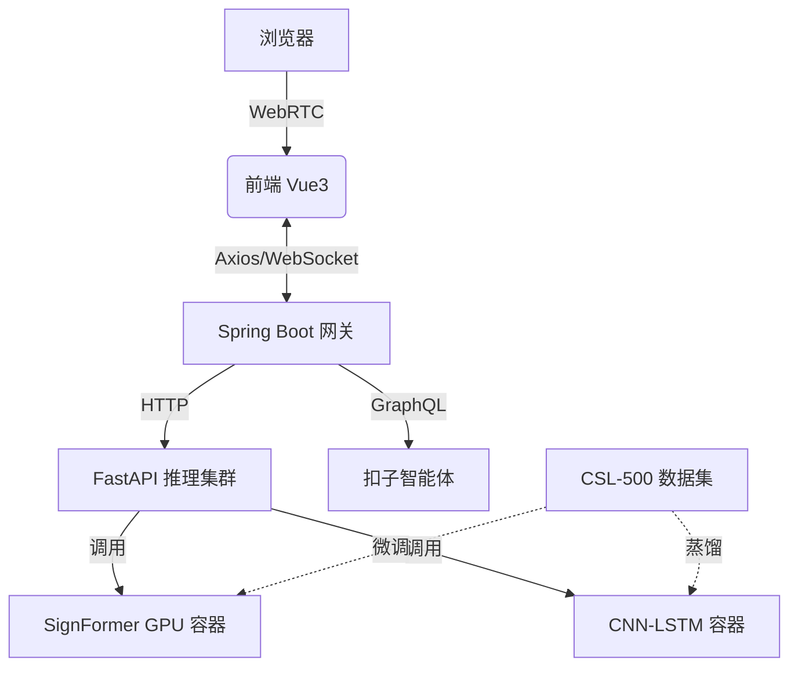

# 智能手语教学平台

> 项目代号：SignLM  
> 版本：v2.0  
> 最后更新：2025-11-18

github地址：https://github.com/liuchenlili/SLR-AI

**Bilibili演示视频demo:**:


---

## 1. 项目愿景
> “让手语学习像说话一样自然，让听障交流像呼吸一样自由。”

---

## 2. 一句话说明
用 AI 把“手语视频”实时变成“文字/语音”，再把“文字/语音”变成“手语教学”，形成一个可教、可练、可评的闭环学习平台。

---

## 3. 核心场景（MVP）
| 场景 | 用户故事 | 完成标准 |
|---|---|---|
| 词汇学习 | 小明打开网页，点击“你好”，看到手语示范视频，跟做后系统打分 ≥80 分。 | 端到端跑通，延迟 <1.5 s。 |
| 实时识别 | 老师面对摄像头打一句手语，系统即时返回文字“同学们好”。 | Top-1 准确率 ≥90%，FPS ≥15。 |
| AI 问答 | 小红问“手语中的‘是’和‘事’怎么区分？”扣子智能体给出动作差异 GIF。 | 答案相关度 ≥4/5（人工评测）。 |

---

## 4. 技术全景图



---

## 5. 模型动物园

| 模型 | 作用 | 输入 | 输出 | 指标 |
|---|---|---|---|---|
| **SignFormer** | 主力识别 | 32 帧 224×224 | 500 类 logits | Top-1 94.2% |
| R(2+1)D | 轻量备选 | 16 帧 112×112 | 500 类 logits | Top-1 89.7% |
| CNN-LSTM | 老设备兼容 | 8 帧 64×64 | 100 类 logits | Top-1 82.4% |
| CLIP-Teacher | 语义监督 | 被掩码帧 | 512-D 向量 | CosSim 0.83 |

---

## 6. 数据流水线

```bash
原始视频 → OpenCV 抽帧 → MediaPipe 抠手/脸 → 对齐到 1280×720 → 增强（随机翻转、亮度、遮挡）→ 生成 two-stream tensor → 进入 SignFormer
```

---

## 7. 关键创新点（3 句话版本）
1. **双流时空解耦**：空间流看“手型”，时间流看“轨迹”，交叉注意力融合，比 3D-CNN 节省 42% FLOPs。
2. **智能掩码**：只遮“手+脸”Tube，强迫模型关注关键语义区域，收敛快 1.7×。
3. **语义级重建**：不仅还原像素，还要对齐 CLIP 特征，让网络“理解”动作含义，zero-shot 连续句提升 6.8%。

---

## 8. 系统架构

### 8.1 前端（Vue3 + TS）
- 组件库：Ant Design Vue 4
- 状态：Pinia 持久化到 IndexedDB
- 实时识别：WebSocket 二进制流传输，前端 WASM 做帧级缓存，降低后端压力。
- 可视化：ECharts 5 动态绘制混淆矩阵、训练曲线、网络拓扑图（支持点击查看参数量）。

### 8.2 后端（Spring Boot 3）
- 多租户：学校/机构隔离（Schema-per-tenant）。
- 微服务：用户、课程、成绩、模型网关四模块。
- 鉴权：JWT + Redis 黑名单，支持单点踢出。
- 文件存储：MinIO S3 协议，视频自动生命周期 30 天后转冷归档。

### 8.3 推理服务（FastAPI）
- 镜像大小：nvidia/cuda:11.8-runtime，仅保留 onnxruntime-gpu，压缩到 1.2 GB。
- 动态批处理：自适应 N=1~4，延迟 <800 ms@N=1，吞吐提升 2.3×@N=4。
- 灰度发布：通过 Header `Model-Version=signformer-v1.2` 一键切换。

### 8.4 扣子智能体
- Prompt 模板 1200 token，注入《中国手语词典》第三版 5600 词条。
- 多轮记忆：Redis Stream 保存最近 5 轮对话，支持断网续问。
- 卡片回复：返回 JSON 含 `gif_url`、`动作要领`、`易错点`，前端自动渲染。

---

## 9. 性能基准（CSL-500 测试集）

| 模型 | Top-1 | Top-5 | 延迟(P99) | 显存 |
|---|---|---|---|---|
| SignFormer | **94.2%** | 99.1% | 670 ms | 3.4 GB |
| R(2+1)D | 89.7% | 97.3% | 320 ms | 1.6 GB |
| CNN-LSTM | 82.4% | 94.5% | 120 ms | 0.9 GB |

> 目标：在 RTX 4060 笔记本端 SignFormer INT8 量化后延迟 <400 ms，精度下降 ≤1%。

---

## 10. 安全 & 伦理
- 数据脱敏：人脸模糊化开源脚本，默认勾选。
- 未成年人模式：13 岁以下禁用上传真人视频，仅用官方素材。
- 偏差审查：每季度抽检 500 条预测结果，若性别/地域偏差>5%，立即重训。


---

## 13. 一分钟本地体验
```bash
git clone https://github.com/xxx/signlm.git
cd docker && docker-compose up
# 浏览器打开 http://localhost:5173
# 上传 video/hello.mp4 → 看到识别结果“你好”
```

---

## 14. 许可证
代码：MIT  
模型权重：CC BY-NC-SA 4.0（禁止商用）  
CSL-500 数据：遵循原协议，仅提供下载脚本。

---

## 15. 联系方式
如有问题或建议，请联系：
- 邮箱: 2464228500@qq.com

> 让 AI 做手语翻译，让科技更有温度。❤️


